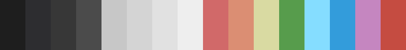

# Theme Collection

A small collection of my preferred 16 colour themes. These themes
conform to the semantics of _base16_, a relatively informal community
project to standardise the use of colours across related applications.
More information can be found in the
[original](https://github.com/chriskempson/base16) and
[community](https://github.com/tinted-theming/home) _base16_
documentation. A much larger selection of themes can be found in
[this](https://github.com/tinted-theming/base16-schemes) repository.

A theme in this format has 16 colours, split into 8 shades and 8
colours. The set of 8 colours is enough for syntax highlighting in most
cases, without the need for any bright colours. The remaining 8 colours
can be used to control the display of user interface elements such as
status lines, gutters, line numbers and menus, which is much more
useful.

## Examples

Here are some of my favourite schemes:

- Gruvbox Dark Hard:


- Gruvbox Material Dark Hard:


- Atom One Dark:


- Visual Studio Code Dark:



## Install

Included is a script to write the YAML formatted themes to _Xresources_
format and generate a set of shell scripts which can change the
true-colour RGB mapping of the ANSI escape sequences of your shell,
effective across all terminal emulators. The script additionally
generates a set of CSS style sheets for use on the web.

```{.bash org-language="sh"}
git clone https://github.com/alexanderneville/b16-themes.git
cd b16-themes
chmod u+x export_themes.sh
./export_themes.sh -i themes/ -o ./out
```
